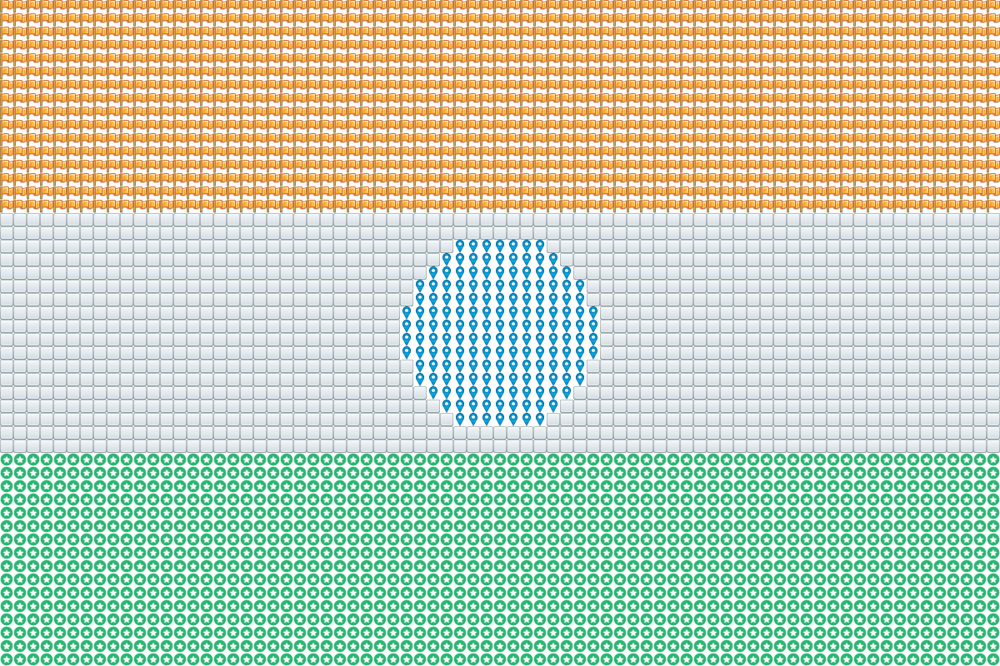

# BrickImageBuilder

Generates a brick based image.



## Original file


# Installation

Run `git clone https://github.com/prathik/brick`.

Needs maven and java.

Run `maven package`.

`brick.jar` will be generated in the `/target` folder.

Run it as given below.

```
usage: java -jar brick.jar
 -f,--image-folder <arg>   Location of the folder with images and
                           values.json file.
 -i,--input-file <arg>     Input file
 -o,--output-file <arg>    Output file
```

# Structure of image folder

See `images/`.

It needs a values.json with red, green and blue value of each image along with the file name.

# Example Run

`cd` into `target/` folder after `mvn package`.

Run `java -jar brick.jar -f ../images/defaults -i ../images/orig.png --output-file ../images/output.png`
